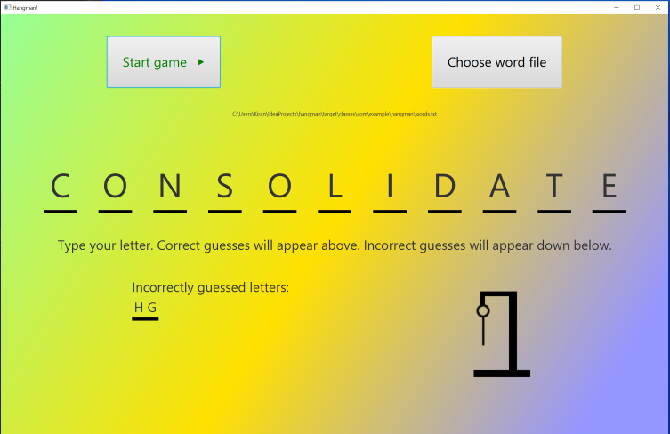
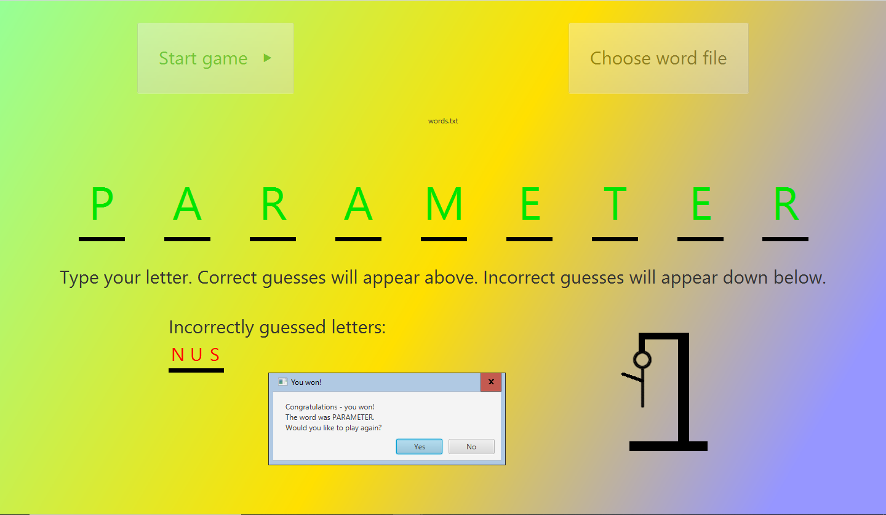
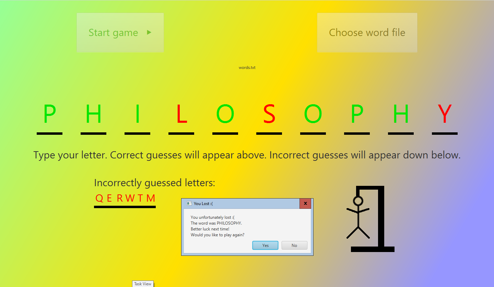
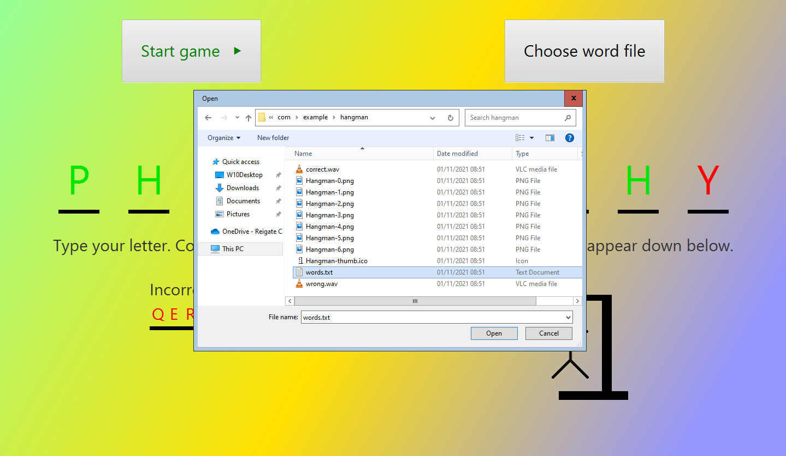

# Hangman
A JavaFX-based hangman game!
This is a java-based version of the classic Hangman game, with user-selectable words and a clean UI.

Upon loading, a start button is displayed, which when clicked begins the game by showing the user an empty word stage with lines representing each unguessed letter in the word.
The user can then press any key and if the key is a letter which has not been guessed, it will be checked for correctness and appropriately placed on screen.

At the end of the game, the letters are colourised based on correctness and a win/lose dialog is displayed with an option to play again.

Windows Hangman test:

Ubuntu Hangman win screenshot:

Ubuntu Hangman lose screenshot:

Ubuntu Hangman choose words file screenshot:

